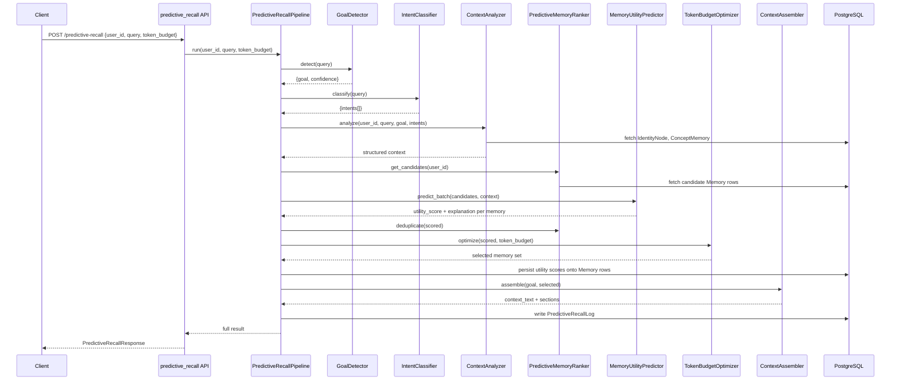

# NeuroWeave — Day 5: Predictive Recall Engine

## Overview

Days 1-4 built a memory *store*: structured memories, cognitive importance
scoring, semantic consolidation into concepts, and an identity graph. All of
it was still surfaced through similarity search — "what looks like this
query?"

Day 5 replaces that retrieval core with **predictive utility-based recall**:

```
Semantic Similarity Search  →  Predictive Utility-Based Recall
"What looks similar?"       →  "What will help solve this task?"
```

Every memory is scored across independent dimensions (goal alignment,
identity alignment, concept relevance, importance, reinforcement,
confidence, recency), combined into a single `utility_score`. The engine
then solves a constrained optimization problem — not "top-N" — to pick the
smallest memory set that maximizes total utility inside a token budget.

## Pipeline

```
Query
  │
  ▼
[1] Goal Detection            GoalDetector            → goal, confidence
  │
  ▼
[2] Intent Classification     IntentClassifier         → intents[], probabilities
  │
  ▼
[3] Context Analysis          ContextAnalyzer           → identity traits, concepts,
  │                                                        required knowledge, keywords
  ▼
[4] Candidate Retrieval       PredictiveMemoryRanker    → wide candidate pool
  │                           .get_candidates()           (bounded by pool size, not
  │                                                        similarity pre-filtered)
  ▼
[5] Utility Prediction        MemoryUtilityPredictor    → per-memory utility_score
  │                                                        + dimension breakdown
  ▼
[6] Ranking + Dedup           PredictiveMemoryRanker    → redundancy eliminated
  │                           .deduplicate()               (Jaccard word-overlap)
  ▼
[7] Token Budget Optimization TokenBudgetOptimizer      → 0/1 knapsack (exact for
  │                                                        ≤60 candidates, greedy
  │                                                        ratio fallback above that)
  ▼
[8] Context Assembly          ContextAssembler          → compact structured text,
  │                                                        no raw chat history
  ▼
LLM
```

Each stage is independently timed (`latency_breakdown_ms` in the API
response) so regressions are attributable to a specific stage.

## Sequence Diagram



## Utility Scoring

Every candidate memory receives an independent score per dimension, then a
configurable weighted sum:

```python
utility = (
    goal_alignment     * 0.30 +
    identity_alignment * 0.20 +
    concept_relevance  * 0.20 +
    importance         * 0.10 +
    reinforcement      * 0.10 +
    confidence         * 0.05 +
    recency            * 0.05
) * memory_type_multiplier
```

| Dimension | Meaning | Source |
|---|---|---|
| `goal_alignment` | Keyword/category overlap with the detected goal | `ContextAnalyzer` required-knowledge map |
| `identity_alignment` | Overlap with the user's identity traits | Day 4 `IdentityNode` |
| `concept_relevance` | Overlap with consolidated semantic concepts | Day 3 `ConceptMemory` |
| `importance` | Cognitive importance score | Day 2 `importance_score` |
| `reinforcement` | Repetition/strength signal | Day 2 `reinforcement_score` + `memory_strength` |
| `confidence` | Stability (low decay rate = more stable) | `memory_strength`, `decay_rate` |
| `recency` | Exponential decay, 90-day half-life | `last_accessed` / `created_at` |

`memory_type_multiplier` is a bounded `[0.85, 1.0]` factor reflecting the
priority order **Identity > Concept > Procedural > Semantic > Episodic** —
it nudges ranking without ever letting type alone override a strong
relevance signal. Weights are configurable per-request (`weights` field) or
globally via `Settings.utility_weight_*` in `app/core/config.py`.

Every score ships with a `selection_reason` — a human-readable explanation
built from the top-contributing dimensions, e.g. *"Selected because it
matches the current goal and aligns with the user's identity profile."*

## Token Budget Optimization

Naive retrieval takes top-N and stops. `TokenBudgetOptimizer` instead
treats this as 0/1 knapsack: value = `utility_score`, weight = estimated
token cost. It solves **exactly** via dynamic programming when the
candidate pool (post-dedup) is ≤ `predictive_recall_knapsack_max_candidates`
(default 60; O(n × budget) time/space). Above that threshold it falls back
to a greedy utility-per-token ratio heuristic — the standard sub-linear
approximation for large-N knapsack, keeping latency bounded as the store
scales toward millions of memories.

## Components

| Component | File | Responsibility |
|---|---|---|
| `GoalDetector` | `app/services/goal_detector.py` | Infers objective from weighted regex signals (extensible `GOAL_SIGNALS` map) |
| `IntentClassifier` | `app/services/intent_classifier.py` | Multi-label intent probabilities (not softmax — intents aren't mutually exclusive) |
| `ContextAnalyzer` | `app/services/context_analyzer.py` | Fuses query + identity + concepts into "what does the AI need to know" |
| `MemoryUtilityPredictor` | `app/services/utility_predictor.py` | Per-memory, per-dimension utility scoring |
| `PredictiveMemoryRanker` | `app/services/memory_ranker.py` | Candidate retrieval, dedup, score persistence |
| `TokenBudgetOptimizer` | `app/services/token_budget_optimizer.py` | Knapsack / greedy budget-constrained selection |
| `ContextAssembler` | `app/services/context_assembler.py` | Merges selection into one compact reasoning block |
| `PredictiveRecallPipeline` | `app/services/predictive_recall_pipeline.py` | Orchestrates all of the above, logs the run |

## Database Changes

`memories` table gains (migration `005_predictive_recall_engine.py`):

```
goal_alignment_score   FLOAT
utility_score          FLOAT
selection_reason       TEXT
prediction_confidence  FLOAT
retrieval_rank         INTEGER
last_prediction_time   TIMESTAMP
```

New table `predictive_recall_logs` (one row per pipeline run) captures the
detected goal/intents, selected memory ids, per-memory explanations, token
stats, and the full per-stage latency breakdown — this is what backs
`GET /retrieval/explanation` and the observability aggregates.

Apply with:
```bash
alembic upgrade head
```

## API

All endpoints registered with no path prefix (see `app/api/predictive_recall.py`):

| Method | Path | Purpose |
|---|---|---|
| POST | `/predictive-recall` | Run the full pipeline end-to-end |
| POST | `/goal-detect` | Goal inference only |
| POST | `/intent-classify` | Intent classification only |
| POST | `/utility-score` | Score specific (or all) memories against a query |
| POST | `/context/assemble` | Assemble context from an explicit memory id list |
| GET | `/retrieval/explanation` | Decision trail for a past run (`user_id`, optional `recall_id`) |

Example:
```bash
curl -X POST http://localhost:8000/predictive-recall \
  -H "Content-Type: application/json" \
  -d '{
    "user_id": "550e8400-e29b-41d4-a716-446655440000",
    "query": "Help me prepare for a backend interview",
    "token_budget": 800
  }'
```
```json
{
  "recall_id": "…",
  "goal": {"goal": "interview_preparation", "confidence": 0.82, "alternative_goals": [], "matched_signals": ["\\binterview(s|ing)?\\b"]},
  "intents": [{"intent": "plan", "probability": 0.45}, {"intent": "learn", "probability": 0.3}],
  "selected_memories": [
    {"memory_id": "…", "memory_type": "identity", "content": "Preparing for backend engineering interviews", "reason": "Selected because it matches the current goal and aligns with the user's identity profile.", "utility": 0.91, "rank": 1}
  ],
  "assembled_context": {"context_text": "User Profile\n\nCurrent Goal:\nInterview preparation\n\n…", "estimated_tokens": 142, "sections": {"...": []}},
  "candidate_count": 37,
  "token_budget": 800,
  "average_utility_score": 0.78,
  "latency_breakdown_ms": {"goal_detection_ms": 0.1, "intent_classification_ms": 0.1, "candidate_retrieval_ms": 4.2, "utility_prediction_ms": 6.8, "ranking_ms": 1.1, "token_optimization_ms": 2.3, "context_assembly_ms": 0.4},
  "total_latency_ms": 15.0
}
```

## Test Cases (validated in `tests/test_predictive_recall.py`)

- *"Help me prepare for a backend interview"* → goal detected as
  `interview_preparation`; identity/procedural memories about interview
  prep and communication style outrank unrelated technical memories.
- *"Let's brainstorm startup ideas"* → goal detected as `startup_ideation`.
- Type priority `Identity > Concept > Procedural > Semantic > Episodic`
  holds with all other dimensions equal.
- Knapsack optimizer finds the value-maximizing subset under budget
  (verified against a classic textbook 0/1 knapsack instance), and the
  greedy fallback still respects the budget above the DP threshold.
- Near-duplicate memories collapse to the higher-utility one; distinct
  memories are both kept.
- Episodic (raw event) memories are excluded from assembled context
  whenever identity/concept/procedural memories are available, and
  included only when nothing else is.

28/28 tests pass. Run with:
```bash
pytest tests/test_predictive_recall.py -v
```

## Observability

`CognitiveObservability.log_predictive_recall_metric` and
`CognitiveAnalytics.get_predictive_recall_performance` (in
`app/utils/observability.py`) track: average utility score, average
selected-memory count, average prompt tokens, average candidate count,
per-stage average latency, and goal distribution — sourced from
`predictive_recall_logs`.

## Scalability Notes

- **Candidate pool is bounded**, not exhaustive: `get_candidates()` caps at
  `predictive_recall_candidate_pool_size` (default 200) ordered by
  importance, so scoring cost stays flat as total memory count grows past
  10M — the bottleneck becomes the DB index on `(user_id, importance_score)`
  rather than the scoring logic itself.
- **Knapsack is deliberately bounded**: exact DP only runs on ≤60
  candidates; beyond that, greedy ratio selection keeps selection
  O(n log n). This is the standard large-N knapsack approximation.
- **Every stage is pure-Python, dependency-free heuristics** (regex
  signals, weighted sums, DP) — no network calls, no LLM round-trip in the
  hot path, keeping the sub-100ms target realistic for pool sizes in the
  low hundreds.
- **Incremental scoring path**: `MemoryUtilityPredictor.predict()` operates
  on one memory at a time, so re-scoring on write (rather than full
  re-scan on read) is a straightforward future optimization.
- **Horizontal scaling**: the pipeline holds no in-process state beyond a
  DB session — safe to run behind a load balancer across N async workers,
  matching the existing Celery/Redis infrastructure from Day 1.
- **Future Rust compatibility**: the utility formula, knapsack DP, and
  goal/intent regex signal tables are pure, side-effect-free functions
  over primitive types — they can be lifted into a Rust extension (PyO3)
  stage-by-stage without changing the pipeline's external contract.

## Future Extensibility

The pipeline is intentionally staged as independent, swappable components
so later work doesn't require re-architecture:

- **Reinforcement learning / feedback optimization**: `UtilityWeights` is
  already a configurable dataclass — an RL loop can update it per-user
  from accept/reject signals on `selection_reason`.
- **Online learning**: `GoalDetector`/`IntentClassifier` signal tables are
  data (`GOAL_SIGNALS`, `INTENT_SIGNALS`), not code — swappable for a
  trained classifier behind the same `detect()`/`classify()` contract.
- **Agent self-reflection**: `PredictiveRecallLog` already records the full
  decision trail per run; an agent can query its own past
  `selection_reason`s via `/retrieval/explanation`.
- **Multi-agent memory sharing**: `ContextAnalyzer` and
  `MemoryUtilityPredictor` are stateless given `(user_id, context)` — a
  cross-user or shared-pool variant only needs a different candidate
  query in `get_candidates()`.

## Known Pre-Existing Issues Fixed Along the Way

While wiring Day 5 into the app, two defects were found that blocked the
**entire application** from importing, not just Day 5 code — fixed as part
of this work since nothing (old or new) could run otherwise:

1. `app/api/identity.py` and `app/api/consolidation.py` imported a
   `get_db` dependency that didn't exist in `app/db/database.py`
   (only `get_db_session` did) — an `ImportError` on startup.
2. `SessionLocal` was built with `async_sessionmaker` bound to the
   *synchronous* engine, so every sync endpoint calling `.query()` would
   have failed at runtime.
3. Every ORM model declared a column literally named `metadata`, which
   collides with SQLAlchemy's reserved `Base.metadata` attribute — models
   never loaded at all. Fixed by mapping `extra_metadata = Column("metadata", ...)`
   (Python attribute renamed, DB column name and existing migrations
   untouched).

Not fixed (out of scope for Day 5, pre-existing and unrelated to this
pipeline): `test_identity.py` fails to collect because
`app.memory.embeddings` doesn't export `get_embedding_service`;
`test_consolidation.py` needs a `db_session` fixture that no `conftest.py`
provides; a handful of Day 2 tests assert on `str(enum_member)` which
doesn't return the enum's value in this codebase's Python/SQLAlchemy
version, plus a couple of float-equality assertions.
