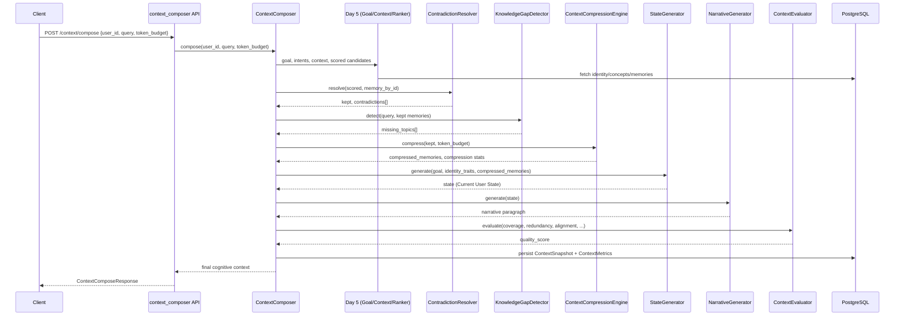

# NeuroWeave — Day 6: Cognitive Context Composer (CCC)

## Overview

Day 5 answered *"which memories are worth retrieving?"* via utility
prediction. Day 6 answers a different question: *"what should the LLM
actually understand before it reasons?"*

```
Retrieve memories → Append memories → Send to LLM        (old)
Understand objective → Reconstruct knowledge →
  Compose optimized cognitive state → Send minimum context   (CCC)
```

Humans don't retrieve memories verbatim — they reconstruct them, shaped by
current goal, identity, and expectations. The same event recalled twice can
come out differently. The Cognitive Context Composer performs the
equivalent reconstruction: it takes the Day 5 utility-ranked memory set and
turns it into a compact, contradiction-free, gap-aware cognitive state
instead of a concatenated memory dump.

## Pipeline

```
Query
  │
  ▼
[1] Goal Detection + Identity/Concept Context   (reused from Day 5:
  │                                               GoalDetector, ContextAnalyzer)
  ▼
[2] Candidate Retrieval + Utility Scoring        (reused from Day 5:
  │                                               PredictiveMemoryRanker)
  ▼
[3] Contradiction Resolution      ContradictionResolver   → conflicts resolved,
  │                                                          evolution preserved
  ▼
[4] Knowledge Gap Detection       KnowledgeGapDetector      → missing_topics
  │
  ▼
[5] Compression                   ContextCompressionEngine  → dedup, merge,
  │                                                          budget-fit (knapsack)
  ▼
[6] State Generation              StateGenerator             → structured
  │                                                          "Current User State"
  ▼
[7] Narrative Generation          NarrativeGenerator          → coherent paragraph
  │
  ▼
[8] Quality Evaluation            ContextEvaluator            → quality_score
  │
  ▼
Final Cognitive Context (persisted as ContextSnapshot + ContextMetrics)
```

Stages 1-2 are **not reimplemented** — CCC composes on top of Day 5's
`GoalDetector`, `ContextAnalyzer`, and `PredictiveMemoryRanker` rather than
duplicating goal detection or utility scoring. Day 6's new work starts at
contradiction resolution.

## Sequence Diagram



## Components

| Component | File | Responsibility |
|---|---|---|
| `ContradictionResolver` | `app/services/contradiction_resolver.py` | Detects same-topic conflicting claims (verb-bucket + word-overlap heuristic), picks a winner by recency+reinforcement+confidence, records the resolution trail |
| `KnowledgeGapDetector` | `app/services/knowledge_gap_detector.py` | Maps query-triggered domains (e.g. "cache", "distributed") to expected subtopics and reports which aren't covered by retained memory |
| `ContextCompressionEngine` | `app/services/context_compression.py` | Dedup (Jaccard), concept merging (clustered by word overlap), knapsack budget-fit (reuses Day 5's `TokenBudgetOptimizer`), graceful degradation when nothing fits whole |
| `StateGenerator` | `app/services/state_generator.py` | Synthesizes the "Current User State" block: primary goal, relevant expertise, preferred communication, reasoning strategy |
| `NarrativeGenerator` | `app/services/narrative_generator.py` | Turns the structured state into one coherent paragraph (template-based, no LLM round trip) |
| `ContextEvaluator` | `app/services/context_evaluator.py` | Scores coverage, redundancy, identity/goal alignment, and a composite `quality_score` |
| `ContextComposer` | `app/services/context_composer.py` | Orchestrates all of the above; `compose()` persists a snapshot, `compose_streaming()` yields per-stage results |

## Contradiction Resolution

Memories are grouped into verb buckets (`preference`, `liking`, `want`,
`usage`, `choice`, `favor`). Within a bucket, two memories are flagged as
conflicting when they share ≥2 non-stopword tokens (same claim template)
but have genuinely different, non-overlapping remaining tokens (different
object) — e.g. *"User prefers React for frontend development"* vs.
*"User prefers Rust for frontend development"* share `{prefers, frontend,
development}` and differ on `{react}` vs. `{rust}`.

The winner is picked by:
```python
resolution_score = recency * 0.40 + reinforcement * 0.35 + memory_strength * 0.25
```
The loser is **not deleted** — it's excluded from the composed context but
the resolution (`kept_content`, `superseded_content`, `reason`) is recorded
in both the response and `ContextSnapshot`, preserving historical
evolution for later inspection.

## Compression

Target: 80-95% token reduction versus raw memory text. Verified in a smoke
test: 10 near-duplicate concept memories (257 raw tokens) compressed to a
single budget-fit entry at **84.4% reduction** under a 40-token budget.

Pipeline: dedup (Jaccard ≥ 0.80) → merge concepts/semantic memories sharing
≥40% word overlap into one statement (capped at 4 fragments per merged
entry, so one cluster can never single-handedly blow the budget) → sort by
utility → knapsack-fit to `token_budget` (Day 5's exact-DP/greedy-fallback
optimizer). If every candidate individually exceeds the budget (e.g. one
oversized merged cluster and nothing else), the engine degrades
gracefully to a truncated single entry rather than returning an empty
context — this was caught and fixed via the end-to-end smoke test during
this build (see *Verification* below).

## Knowledge Gap Detection

Data-driven, not hardcoded logic: `TOPIC_EXPECTATIONS` maps query patterns
(e.g. `\bcach(e|ing)\b`, `\bdistributed\b`) to expected subtopics. For
*"Design a distributed cache"* with only Redis/scaling memories on hand,
detection correctly returns
`["Consistency", "Replication", "Partition Tolerance", "Cap Theorem", "Eviction Policy"]`
— verified live in the end-to-end smoke test. This is intentionally decoupled
from any specific retrieval backend so a future RAG/documentation lookup can
be triggered *only* for the reported gaps, not proactively for everything.

## Database Changes

`context_snapshots` (migration `006_cognitive_context_composer.py`):
```
id, user_id, query, detected_goal, generated_context, narrative,
context_quality, token_count, original_token_count, compression_ratio,
contradiction_count, missing_topics, source_memory_ids,
total_latency_ms, metadata, created_at
```

`context_metrics` (FK to `context_snapshots.id`):
```
id, snapshot_id, coverage, redundancy, identity_alignment,
goal_alignment, quality_score, created_at
```

Kept as two tables (per spec) rather than one so the scoring rubric in
`context_metrics` can evolve independently of the snapshot record.

Apply with `alembic upgrade head`.

## API

| Method | Path | Purpose |
|---|---|---|
| POST | `/context/compose` | Run the full pipeline, persist a snapshot |
| POST | `/context/evaluate` | Score a specific memory set's context quality |
| POST | `/context/compress` | Compress a specific memory set alone |
| POST | `/context/narrative` | Generate narrative + state from a specific memory set |
| POST | `/context/gaps` | Detect knowledge gaps for a query |
| GET | `/context/history` | Past compositions for a user (`user_id`, `limit`) |
| GET | `/context/metrics` | Aggregated observability stats (`user_id`, `limit`) |

Note: Day 5 already owns `POST /context/assemble` (simple assembly from an
explicit memory list, no reconstruction). Day 6's routes live under the
same `/context` prefix but don't collide — `assemble` is Day 5's
similarity-era endpoint, `compose` is the CCC replacement.

## Test Cases (validated in `tests/test_context_composer.py`, 18/18 passing)

- Conflicting preference memories (`"prefers React"` → `"now prefers
  Rust"`) are detected and resolved to the newer, more reinforced claim;
  unrelated memories are never flagged; episodic memories are never
  compared (events don't "conflict" the way stated preferences do).
- *"Design a distributed cache"* correctly triggers `consistency` and
  `replication` as missing topics when absent, and excludes them once a
  memory explicitly covers them.
- Compression deduplicates near-identical memories, merges overlapping
  concept memories into one entry, respects the token budget, and produces
  a `compression_ratio` in `[0, 1]`.
- `StateGenerator` produces the goal/expertise/communication/reasoning
  sections and picks a goal-appropriate reasoning strategy (e.g.
  "root-cause" language for `debugging`).
- `NarrativeGenerator` produces non-empty coherent text and a defined
  fallback for empty state.
- `ContextEvaluator` returns full coverage when no knowledge is required,
  a `quality_score` always in `[0, 1]`, and contradictions measurably
  reduce quality.

Full end-to-end pipeline (not just unit tests) was also run against a live
SQLite-backed `ContextComposer.compose()` call, confirming goal detection,
contradiction resolution, gap detection, compression, narrative, and
evaluation all interoperate correctly — this is what caught the merge/
budget edge case described above.

## Observability

`CognitiveAnalytics.get_context_composition_performance()` (in
`app/utils/observability.py`) aggregates: average context size (token
count), compression ratio, average quality score, contradiction count,
average knowledge gaps detected, and average latency — sourced from
`context_snapshots` joined with `context_metrics`, exposed via
`GET /context/metrics`.

## Scalability Notes

- **No new retrieval path**: CCC reuses Day 5's bounded candidate pool
  (`predictive_recall_candidate_pool_size`, default 200) rather than
  scanning the full memory store, so it inherits Day 5's 10M+-memory
  scaling story rather than reintroducing an unbounded scan.
- **Compression is O(n²) in the *post-dedup* candidate count** for concept
  merging (pairwise cluster placement) — bounded by the same pool cap, so
  this stays cheap (n ≤ 200) even as total stored memories grow.
- **Contradiction resolution is O(n²) within a verb bucket**, not across
  the whole candidate set — buckets are typically small (a handful of
  preference-type memories per user), keeping this fast in practice.
- **Pure Python, dependency-free heuristics** throughout (regex, Jaccard,
  the Day 5 knapsack) — no LLM round-trip in the hot path, consistent with
  the sub-100ms target for realistic candidate-pool sizes.
- **Streaming**: `ContextComposer.compose_streaming()` yields a dict after
  each pipeline stage (`goal_detection`, `contradiction_resolution`,
  `compression`, `narrative`, `final_context`, ...) for progressive
  rendering. It does not persist a snapshot (that stays `compose()`'s job).
  Wiring this to an actual SSE endpoint is a natural, small next step —
  the generator contract is already there.
- **Future Rust migration**: contradiction detection, gap matching, and
  compression scoring are pure functions over primitive types (same
  property as Day 5's utility formula and knapsack) — portable to a PyO3
  extension stage-by-stage without touching the pipeline's external shape.

## Future Extensibility

- **Offline dreaming / memory reconsolidation**: `ContradictionResolver`'s
  resolution trail (`superseded_memory_id`, `reason`) is already the data
  structure an offline consolidation job would replay to permanently
  demote/archive superseded memories rather than just excluding them
  per-request.
- **Lifelong learning**: `ContextSnapshot.missing_topics` is a ready-made
  queue — a background job can watch for repeated gaps across snapshots
  and trigger targeted retrieval/document ingestion.
- **Multi-agent shared cognition**: `StateGenerator`/`NarrativeGenerator`
  take `(goal, identity_traits, compressed_memories)` as plain data, not a
  single-user-coupled object — a shared-pool variant only needs a
  different `_gather()` in `ContextComposer`.
- **Model-agnostic memory transfer**: the final `generated_context` is
  plain text with no model-specific formatting — portable to any LLM
  provider unchanged.
- **Reinforcement learning / autonomous planning**: `quality_score` is
  already logged per-snapshot; an RL loop optimizing `UtilityWeights`
  (Day 5) or the CCC quality weights (`settings.ccc_quality_weight_*`) has
  a ready reward signal without new instrumentation.

## Known Limitation (found via smoke test, fixed during this build)

Unbounded concept-merging could produce a single merged entry larger than
the entire token budget, which the knapsack correctly excludes as
infeasible — but with nothing else to fall back to, that meant the
*entire* cluster silently vanished from context. Fixed two ways: merged
entries are capped at `MAX_MERGED_FRAGMENTS = 4` source memories, and
`ContextCompressionEngine` now falls back to a truncated single
highest-utility entry when nothing fits whole, instead of returning an
empty context. Verified: a 10-memory, 257-token corpus under a 40-token
budget now correctly compresses to 84.4% reduction instead of 100% (empty).
